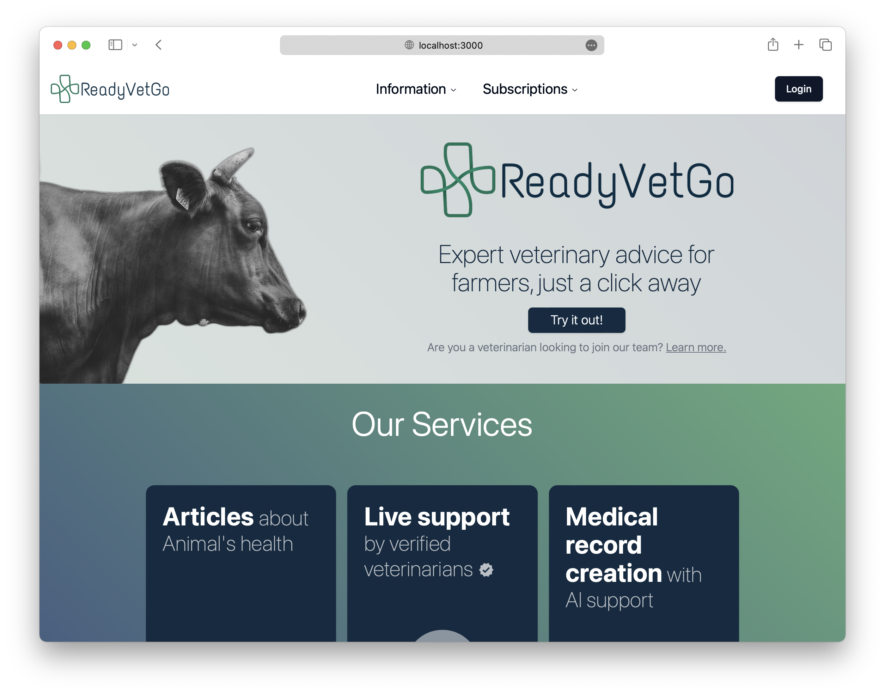
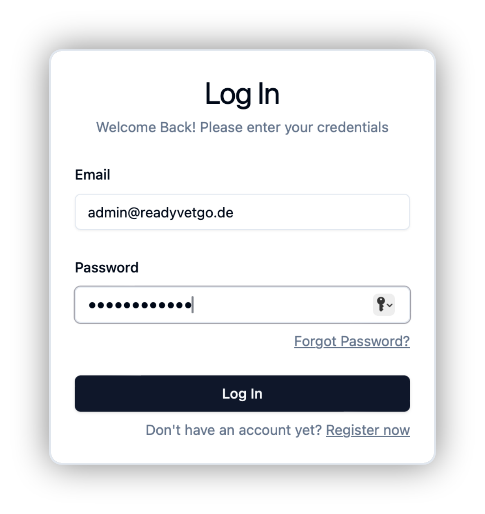
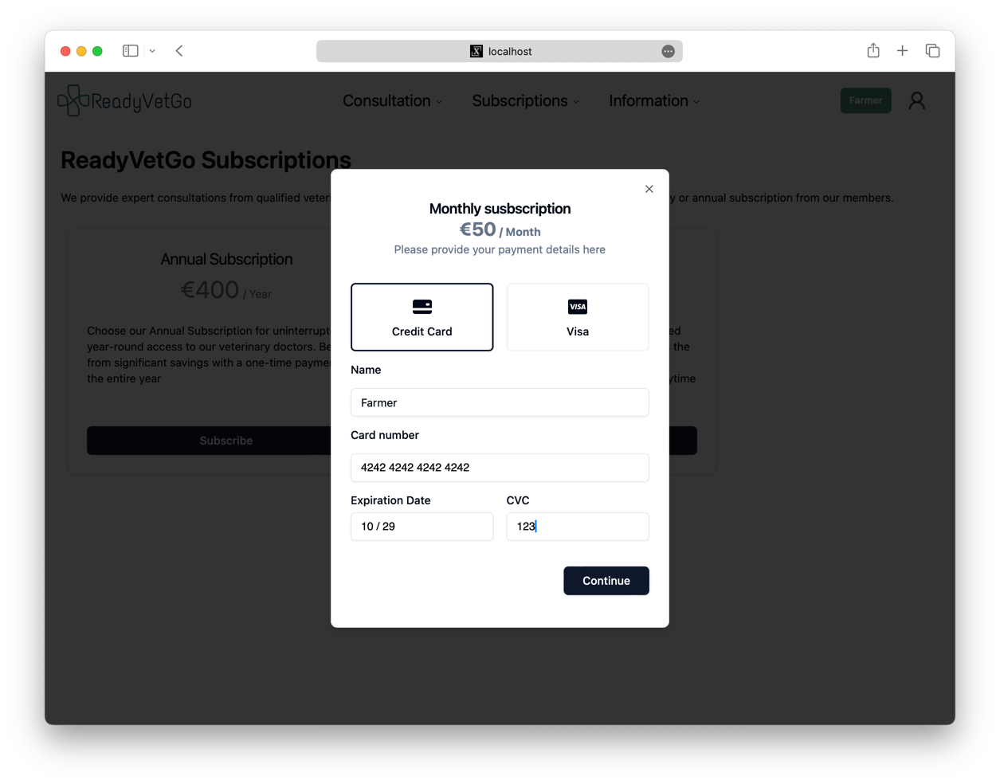

Ready Vet Go is a platform that connects farmers with veterinarians.
Farmers can get medical consultations for their animals from veterinarians through the platform.

This project was created by a team of 4 students from the [Technical University of Munich](https://www.tum.de)
as part of the course
[Software Engineering for Business Applications](https://wwwmatthes.in.tum.de/pages/1mqqqoqe7gapz/Software-Engineering-for-Business-Applications-SEBA-Master)
in the summer semester of 2024.

## Subdomains

### Production

Frontend:
https://readyvetgo.de

Backend: https://api.readyvetgo.de

### Development

Frontend:
https://dev.readyvetgo.de

Backend: https://api.dev.readyvetgo.de

## Getting started

Run docker compose to start the whole project:

```shell
docker compose up
```



2. Open the frontend in your browser: http://localhost:3000


### Development
#### Frontend
Go into the `frontend` folder, then run
```shell
npm install
npm run dev
```
#### Backend
Go into the `backend` folder, then run
```shell
npm install
npm run dev
```

## Features

### Authentication



You can register as a veterinarian or farmer by clicking **login** in the top right corner.
### Subscription



Farmers must subscribe at http://localhost:3000/subscriptions before they can start a consultation. 
> ℹ️ You can use this test card number: 
> ```
> Card Number: 4242 4242 4242 4242
> Expiration Date: any date in the future
> CVC: Any number
> ```
> to test the subscription functionality.

### Consultation

Farmers can start a consultation with a veterinarian by clicking in `Consultation -> New Consultation` or going
to http://localhost:3000/new-chat.

Veterinarians can see open and ongoing consultations at `Consultation -> Chat Overview` or going
to http://localhost:3000/chat-overview were they're able to join a consultation.

All users can see all the chats they have created or have been assigned to. `Consultation -> Chat History` or http://localhost:3000/chat-history

After a consultation is finished, the veterinarian should close the consultation which will forward the vet to the Medical Report page.

### Medical Report
Veterinarians can create a medical report for the consultation by closing the consultation. 

Saved records can be viewed in the http://localhost:3000/medical-records page.

The records are AI based prefilled on the basis of the consultation chat.

### Blog Posts

Veterinarians can create blog posts to raise awareness about animal health, which also helps improve Ready Vet Go's visibility on search engines. 

Vets can view their blog posts and create new ones at http://localhost:3000/cms-editor/overview.

### Admin Functionality
- Verify veterinarians http://localhost:3000/verify-vet
- Approve blog posts http://localhost:3000/approve-blogpost
- View Subscriptions http://localhost:3000/allSubscriptions

## Tech-Stack - Libraries Used

### Frontend

- **[React](https://react.dev/):** library for building user interfaces based on components
- **[Vite](https://vitejs.dev/):** used as our development server and to generate our production build
- **[Shacdn/ui](https://ui.shadcn.com/):** collection of re-usable components that we can customize in our app
    - **[Tailwind CSS](https://tailwindcss.com/):** CSS Framework, dependency of Shacdn/ui
    - **[Radix UI](https://www.radix-ui.com/):** open source component library, dependency of Shacdn/ui
- **[React-Redux](https://redux.js.org/):** state management library for React
- **[Dnd-Kit](https://dndkit.com/):** Drag and drop library for React
- **[stripe](https://stripe.com/):** Online payment library


### Backend

- **[Express](https://expressjs.com/):** back end web application framework
- **[Mongoose](https://mongoosejs.com/):** Object Data Modeling (ODM) library for MongoDB
- **[Mailgun.js](https://www.mailgun.com/):** Mailgun library to send emails using our `readyvetgo.de` domain
- **[socket.io](https://socket.io/):** Event-driven library for real-time web applications
- **[stripe](https://stripe.com/):** Online payment library
